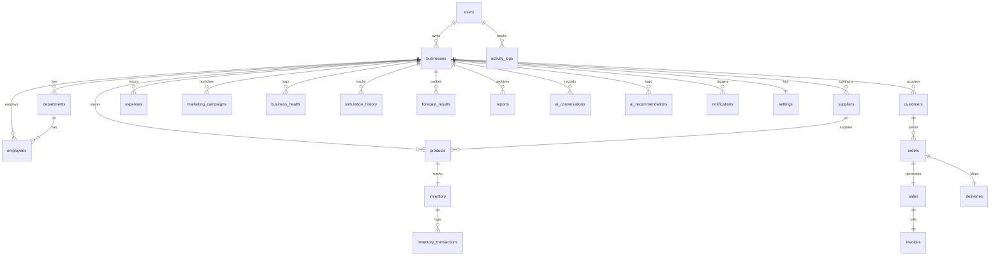

# BusinessVerse AI - PostgreSQL Database Documentation

This document describes the Supabase PostgreSQL database architecture designed to support the **BusinessVerse AI** SaaS operations. The design is optimized for fast page loads under multi-tenant environments using explicit foreign key indexes and strict isolation policies.

---

## 1. Relational Entity Schema & ER Diagram

The database consists of **25 normalized tables** that map user actions, operational logs, simulation runs, and AI recommendations.



---

## 2. Table Specifications & Indexes

### Core Identity & Account Metadata
1. **[users](file:///c:/Users/Mahalakshmi/OneDrive/Desktop/hack-demo/supabase/migrations/00_schema.sql#L13-L21)**: Linked to Supabase Auth tables. Contains roles (`owner`, `admin`, `manager`, `viewer`) and timestamps.
   - *Index*: `idx_users_email` (B-Tree on `email`).
2. **[businesses](file:///c:/Users/Mahalakshmi/OneDrive/Desktop/hack-demo/supabase/migrations/00_schema.sql#L24-L33)**: Multi-tenant business entities.
   - *Index*: `idx_businesses_owner` (B-Tree on `owner_id`).

### Supply Chain & Warehousing
3. **[suppliers](file:///c:/Users/Mahalakshmi/OneDrive/Desktop/hack-demo/supabase/migrations/00_schema.sql#L59-L71)**: Vendor metadata, performance ratings (1.0 to 5.0), and lead times.
4. **[products](file:///c:/Users/Mahalakshmi/OneDrive/Desktop/hack-demo/supabase/migrations/00_schema.sql#L74-L87)**: Stock items. Price/cost parameters are mapped here.
   - *Index*: `idx_products_sku` (B-Tree on `sku`).
5. **[inventory](file:///c:/Users/Mahalakshmi/OneDrive/Desktop/hack-demo/supabase/migrations/00_schema.sql#L90-L102)**: Real-time stock counts. Employs a Postgres virtual generated column `available_qty` representing `current_quantity + incoming_qty - outgoing_qty - reserved_qty`.
6. **[inventory_transactions](file:///c:/Users/Mahalakshmi/OneDrive/Desktop/hack-demo/supabase/migrations/00_schema.sql#L105-L112)**: Logs inventory inputs, write-offs, and POS checkouts.

### Sales & Distribution Hub
7. **[customers](file:///c:/Users/Mahalakshmi/OneDrive/Desktop/hack-demo/supabase/migrations/00_schema.sql#L115-L127)**: Customer profiles, phone registries, and retention scores.
   - *Index*: `idx_customers_email` (B-Tree on `email`), `idx_customers_name` (B-Tree on `name`).
8. **[orders](file:///c:/Users/Mahalakshmi/OneDrive/Desktop/hack-demo/supabase/migrations/00_schema.sql#L130-L141)**: Store checkout registry.
9. **[sales](file:///c:/Users/Mahalakshmi/OneDrive/Desktop/hack-demo/supabase/migrations/00_schema.sql#L144-L154)**: Revenue and net margins ledger.
10. **[invoices](file:///c:/Users/Mahalakshmi/OneDrive/Desktop/hack-demo/supabase/migrations/00_schema.sql#L157-L165)**: Account receivables and billing records.
11. **[deliveries](file:///c:/Users/Mahalakshmi/OneDrive/Desktop/hack-demo/supabase/migrations/00_schema.sql#L189-L200)**: Shipping logs, transit duration metrics, and client satisfaction ratings.

### Human Capital (HR) & Administration
12. **[departments](file:///c:/Users/Mahalakshmi/OneDrive/Desktop/hack-demo/supabase/migrations/00_schema.sql#L36-L43)**: Corporate department classifications.
13. **[employees](file:///c:/Users/Mahalakshmi/OneDrive/Desktop/hack-demo/supabase/migrations/00_schema.sql#L46-L56)**: Employee profiles, salaries, attendance records, and utilization indicators.

### Decision Intelligence & AI Memory
14. **[business_health](file:///c:/Users/Mahalakshmi/OneDrive/Desktop/hack-demo/supabase/migrations/00_schema.sql#L214-L225)**: Cache for overall, sales, marketing, inventory, and labor health indices.
15. **[simulation_history](file:///c:/Users/Mahalakshmi/OneDrive/Desktop/hack-demo/supabase/migrations/00_schema.sql#L228-L237)**: Logs input configurations and outcome vectors.
16. **[forecast_results](file:///c:/Users/Mahalakshmi/OneDrive/Desktop/hack-demo/supabase/migrations/00_schema.sql#L240-L249)**: Stores monthly revenue and inventory projections.
17. **[ai_conversations](file:///c:/Users/Mahalakshmi/OneDrive/Desktop/hack-demo/supabase/migrations/00_schema.sql#L259-L267)**: User chat history memory.
18. **[ai_recommendations](file:///c:/Users/Mahalakshmi/OneDrive/Desktop/hack-demo/supabase/migrations/00_schema.sql#L270-L281)**: Tracks active, applied, or dismissed strategic recommendations.

---

## 3. Row Level Security & Multi-Tenant Separation

To prevent data leakage across different business clients, we configure **Supabase Row Level Security (RLS)**:
- **`get_user_businesses()`**: Helper function that determines what tenant IDs the user owns.
- All core tables enforce `ALTER TABLE ... ENABLE ROW LEVEL SECURITY;`.
- Tables linked to business carry standard tenant checking:
  ```sql
  CREATE POLICY tenant_isolation ON products 
    FOR ALL 
    USING (business_id IN (SELECT get_user_businesses()));
  ```
- Sub-dependent entities (like inventory transaction details) use join isolation filters:
  ```sql
  CREATE POLICY tenant_isolation_inv ON inventory 
    FOR ALL 
    USING (product_id IN (
      SELECT id FROM products WHERE business_id IN (SELECT get_user_businesses())
    ));
  ```

---

## 4. Query Tuning & B-Tree Indexes

We set up explicit B-Tree indexes on:
1. **Foreign References**: All FK fields (`business_id`, `product_id`, `order_id`) are indexed to speed up join operations on dashboard charts.
2. **Timeline Queries**: Chronological query targets (`orders.created_at`, `sales.created_at`, `expenses.created_at`) are indexed descending (`DESC`) for fast aggregation of recent logs.
3. **Unique Lookups**: `sku` and `email` columns are indexed to provide constant-time \(O(1)\) lookups.
